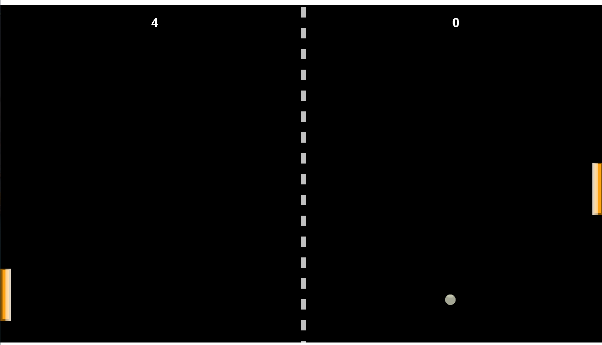

# Pong
Simple Pong game with C and SDL2 library.

Menu with 2 play modes: 1 player vs bot and 2 players.

Player 1 use W/D key to move the paddle, player 2 use  the UP/DOWN key.
## Screenshots

## Requirements
* CMake > 3.10
  * [CMake official page](https://cmake.org/)
* Make > 4.4.1
* GCC > 6.3.0
  * MinGW on Windows: [Download on Sourceforge](https://sourceforge.net/projects/mingw/)
* SDL2 library 
  * [SDL2 repo](https://github.com/libsdl-org/SDL)
* SDL2_ttf library
  * [SDL2_ttf repo](https://github.com/libsdl-org/SDL_ttf)
* SDL2_image library
  *  [SDL2_image repo](https://github.com/libsdl-org/SDL_image)
## Build Instructions
### For Linux
1. Make sure SDL2 and SDL2_ttf are installed in `/usr/local/` otherwise you have to edit the library and include path inside the CMakeLists.txt file.
2. Create a bin folder inside this repo `mkdir bin && cd bin`
3. Compile cmake and build `cmake .. && make`
### For Windows
1. Change the `mingw_dev_lib` in the CMakeLists.txt file with the location of your SDL2 and SDL2_ttf library, SDL2_image.
2. Create a bin folder inside this repo `mkdir bin && cd bin`
3. Compile cmake and build `cmake .. -G "MinGW Makefiles" && make`
